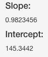

```{r setup, include=FALSE}
knitr::opts_chunk$set(echo = FALSE)
```

## Reproducible Pitch

This is an R Markdown presentation explaining the functionality of my shiny app <https://bhanlam.shinyapps.io/myShinyApp/>.

This application explores the *airquality* dataset with a user adjustable **histogram** and a **linear model plot** to explore the relationships between two user-selectable variables at a time.

The *airquality* dataset represents daily air quality measurements in New York, May to September 1973.

```{r,echo=FALSE,message=FALSE,warning=FALSE}
str(airquality)
```

## Histogram (1/2)

<font size="3">The histogram shows the frequency distribution of each variable:

1. Ozone: Ozone (ppb)
2. Solar.R: Solar Radiance (lang)
3. Wind: Wind (mph)
4. Temp: Temperature(degrees F)

</font>
<center> {width=450px} </center>

## Histogram (2/2)

<font size="3">The histogram for each variable will be dynamically displayed by selecting the respective radio button as shown in the figure below: </font>

<center>  </center>

<font size="3">The number of bins can also be adjusted using a slider:
</font>

<center>  </center>

## Linear Model

<font size="3">The user can also explore the relationship between two variables by selecting from similar radio button options:
<center>  </center>

The desired data points to be included can be selected and the intercept and slope of the fitted *lm* line is displayed as follows:</font>

<center>  {width=300px} </center>
